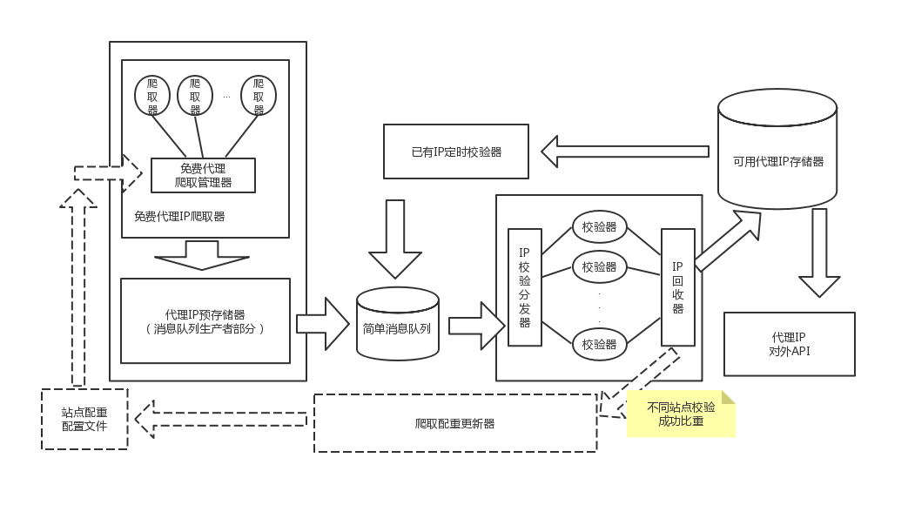

# ProxyPool
> 简单的代理IP池 所有数据收集自互联网

 ### 免费代理IP Web站点
> http://ip.jiangxianli.com/  
> http://www.ip3366.net/free/  
> https://www.kuaidaili.com/free/inha/1/  
> http://www.xicidaili.com  

## 基本想法
 

### 分类
1. 原始代理IP数据收集部分
2. IP校验部分
3. 已有IP重新加入校验池部分
4. 对外Web API部分

#### 1. 原始代理IP数据收集部分
> 使用定时任务随机从已有爬取函数中选择一个获取对应的IP数据  
> 并存储到消息队列(redis)中

#### 2. IP校验部分
> 构建线程池，分发消息队列中的代理IP数据  
> 获取消息队列中的ip数据通过http://httpbin.com/ip校验代理ip是否可行  
> 通过回调函数将校验过的IP数据收集到持久化层中(MySQL)

#### 3. 已有IP重新加入校验池部分
> 使用定时任务将持久化层中的较早代理IP数据加入消息队列

#### 4. 对外Web API部分
> 使用flask实现简单的RESTful风格API

### 存在问题
1. 爬取的免费代理中大部分为失效代理
2. 已实现的收集部分存在较高的随机性并且收集数据量不大（单次10～30个代理IP信息）
3. 日志记录存在问题，目前只记录少量日志。
4. 配置设置存在问题
